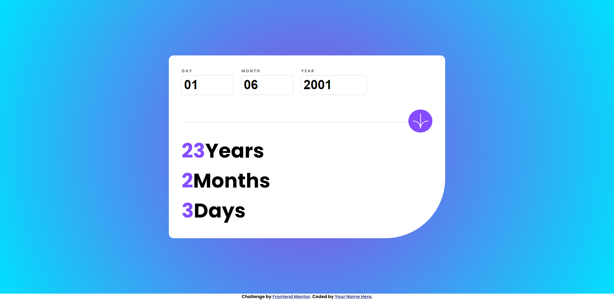

# Frontend Mentor - Age calculator app solution

This is a solution to the [Age calculator app challenge on Frontend Mentor](https://www.frontendmentor.io/challenges/age-calculator-app-dF9DFFpj-Q). Frontend Mentor challenges help you improve your coding skills by building realistic projects.

## Table of contents

- [Overview](#overview)
  - [The challenge](#the-challenge)
  - [Screenshot](#screenshot)
  - [Links](#links)
- [My process](#my-process)
  - [Built with](#built-with)
  - [What I learned](#what-i-learned)
  - [Continued development](#continued-development)
  - [Useful resources](#useful-resources)
- [Author](#author)
- [Acknowledgments](#acknowledgments)

**Note: Delete this note and update the table of contents based on what sections you keep.**

## Overview

### The challenge

Users should be able to:

- View an age in years, months, and days after submitting a valid date through the form
- Receive validation errors if:
  - Any field is empty when the form is submitted
  - The day number is not between 1-31
  - The month number is not between 1-12
  - The year is in the future
- View the optimal layout for the interface depending on their device's screen size
- See hover and focus states for all interactive elements on the page

### Screenshot



### Links

- Solution URL: [github link](https://github.com/Yussif20/age-by-day-calculator-js)
- Live Site URL: [live site url](https://yussif20.github.io/age-by-day-calculator-js/)

## My process

### Built with

- Semantic HTML5 markup
- CSS custom properties
- Flexbox
- CSS Grid
- SCSS
- JavaScript

### What I learned

It helped me to practice logic thinking and learned how to validate data.

And this is the function I used to calculate age:

```js
const calcAge = (year, month, day) => {
  const birthDate = new Date(year, month - 1, day);
  const today = new Date();

  const birthDay = birthDate.getDate();
  const currentDay = today.getDate();
  const birthMonth = birthDate.getMonth();
  const currentMonth = today.getMonth();
  const birthYear = birthDate.getFullYear();
  const currentYear = today.getFullYear();

  let yearDiff = currentYear - birthYear;
  let monthDiff = currentMonth - birthMonth;
  let dayDiff = currentDay - birthDay;

  if (dayDiff < 0) {
    monthDiff--;
    dayDiff = 30 + dayDiff;
  }
  if (monthDiff < 0) {
    yearDiff--;
    monthDiff = 12 + monthDiff;
  }
  yearResult.textContent = yearDiff;
  monthResult.textContent = monthDiff;
  dayResult.textContent = dayDiff;
};
```

## Author

- Website - [Yusif Ayman](https://yussif20.github.io/main-portfolio/)
- linkedin - [Yusif Ayman](https://www.linkedin.com/in/yussif-ayman/)
- Github - [Yusif Ayman](https://github.com/Yussif20)
- Frontend Mentor - [Yusif ayman](https://www.frontendmentor.io/profile/Yussif20)
